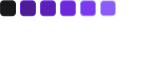
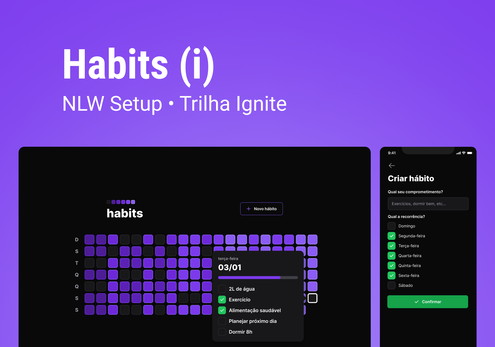

<h4 align="center">
    
</h4>

<p align="center">
  Setup Habits 🚀
  <br>
  <br>

  

  <a href="https://rocketseat.com.br">
    
  </a>

  <a href="https://github.com/LMThomaz/nlw-setup/commits/master">
    
  </a>

  
</p>

## :mag: Sobre o projeto

Ajudamos pessoas a gerenciar seus hábitos
Desenvolvido durante a Next Level Week, oferecida pela [Rocketseat :rocket:][url-rocketseat] na verão **Ignite** :coffee:  
O NLW detêm muito conteúdo prático, desafios e hacks onde o conteúdo fica disponível durante uma semana.
A criação do projeto veio com coincidência da virada de ano, onde criamos novos hábitos.

## :art: O protótipo?

O layout da aplicação está disponível no [Figma][url-figma]  


## :hammer: Tecnologias?

O projeto utiliza as seguintes ferramentas:

- [TypeScript][url-ts]
- [NodeJS][url-node]
- [React][url-react]
- [Expo][url-expo]
- [React Native][url-react-native]

## :electric_plug: Como usar?

> :bulb: A versão web e mobile depende que o server esteja sendo executado para seu funcionamento.

Considerando que o projeto foi divido em três partes:

1. Back End (server)
2. Front End (web)
3. Mobile (mobile)

## :hand: Pré-requisitos

É **necessário** que tenha instalado em sua máquina:

- [Git][url-git]
- [Noje.js][url-node]
- Um gerenciador de pacotes como [NPM][url-npm] ou [Yarn][url-yarn]
- [Expo][url-expo] instalado de forma global

## :package: Como clonar a aplicação?

```bash
# Clonar o repositório
$ git clone https://github.com/LMThomaz/nlw-setup
```

## :rocket: Como executar a aplicação?

```bash
# Instalar as dependências (server e web)
$  npm install
# Instalar as dependências (mobile)
$  npm install && npx expo install

## Criar a base de dados
$ cd server
$ npx prisma migrate dev
$ npx prisma generate

# Iniciar a API
$ cd server
$ npm run dev

# Iniciar versão web
$ cd web
$ npm run dev

# Iniciar versão mobile
$ cd mobile
$ expo expo start

```

## :coffee: Como posso ajudar?

1. Faça o Fork deste repositório
2. Comece uma branch com sua feature

```bash
$ git checkout -b minha-feature
```

3. Confirme (Commit) seus feitos

```bash
$ git commit -m 'Minha nova feature'
```

4. Suba (push) sua branch

```bash
$ git push origin minha-feature
```

## :mortar_board: Quem ministrou ?

As aulas foram ministradas pelo [Diego Fernandes][diego] juntamente com o [Rodrigo Gonçalves][rodrigo], nas aulas do **Next Level Week - Setup Habits** :rocket:

## :page_with_curl: Licença

O projeto está utilizando a licença MIT. Confira [LICENSE][license] para mais detalhes.

---

<h4 align="center">
Feito com 💜 por <a href="https://www.linkedin.com/in/leonardo-thomaz/" target="_blank">Leonardo Thomaz</a>
</h4>
 
[url-figma]: https://www.figma.com/file/Ts0IZSw0Zubqnw4qDNctcD/Habits?node-id=6%3A910&t=ibSjHiw2UeRBSWdE-1
[url-ts]: https://www.typescriptlang.org/
[url-node]: https://nodejs.org/pt-br/
[url-react]: https://reactjs.org/
[url-react-native]: https://reactnative.dev/
[url-expo]: https://expo.io/
[url-rocketseat]: https://rocketseat.com.br/
[url-git]: https://git-scm.com/
[url-npm]: https://www.npmjs.com/
[url-yarn]: https://yarnpkg.com/
[diego]: https://github.com/diego3g
[rodrigo]: https://www.linkedin.com/in/rodrigo-goncalves-santana/
[license]: https://github.com/LMThomaz/nlw-setup/blob/master/LICENSE.md
